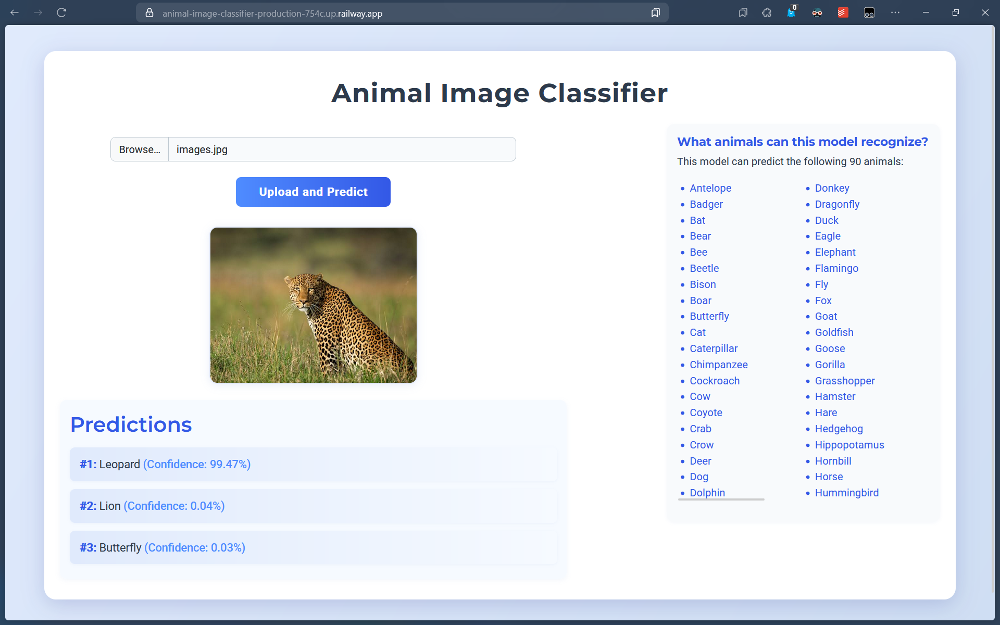

# Animal Image Classifier
Deep learning-powered web application that identifies animals in images with high accuracy. Built using Flask and PyTorch, the app allows users to upload any animal image and get the top 3 predicted species along with their confidence levels.

[Web App Link](https://animal-image-classifier-production-754c.up.railway.app/)

## Demo



## Features

- Image classification using a fine-tuned EfficientNet-B2 model
- Web interface to upload images
- Top-3 prediction results with confidence scores
- Simple and clean Flask backend
- JSON API response for integration into other applications

## Technologies Used

- Python
- Flask
- PyTorch
- Torchvision
- Pillow
- Railway (Deployment)

## Getting Started

### 1. Clone the repository

```bash
git clone https://github.com/gokulkrishna1686/animal-image-classifier.git
cd animal-image-classifier
```

### 2. Create a virtual environment (optional but recommended)

```bash
python -m venv .venv
.venv\Scripts\activate
```

### 3. Install Dependencies

```bash
pip install -r requirements.txt
```

### 4. Run the App

```bash
python app.py
```

### 5. Open and Test

If everything’s working, you’ll see something like: 

```bash
Running on http://127.0.0.1:5000/
```

Open that address in your browser.

- Use the upload form on the web page.
- Select an image of an animal.
- Submit and see the top 3 predicted animal names with confidence scores.